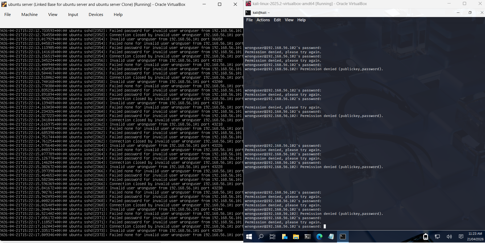
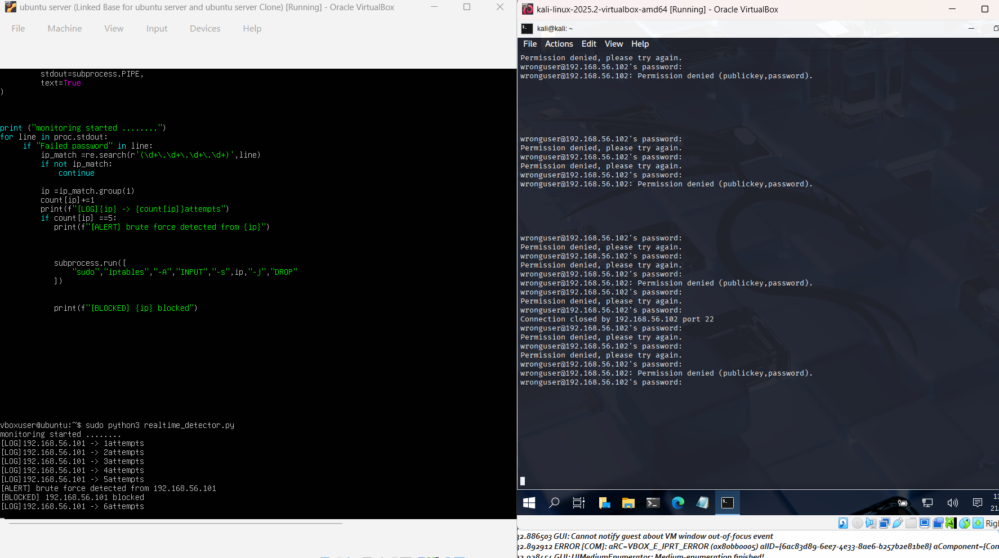
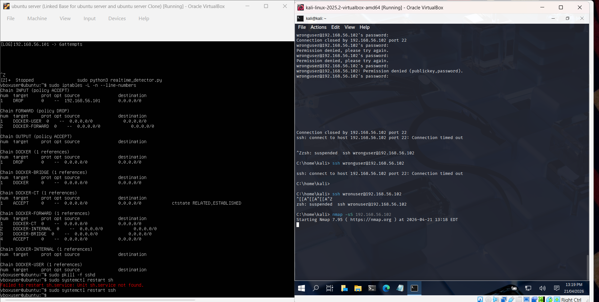

# 🔐 Brute Force Detection & Automated Response

> Detecting and blocking SSH brute-force attacks using Python and iptables


## 🧠 Overview

This project demonstrates how a brute-force attack against an SSH service can be detected and mitigated using log analysis and automated response.

A simulated attacker repeatedly attempts failed logins, generating authentication logs on the target system. A Python-based detection script monitors these logs, identifies suspicious patterns, and extracts the attacker’s IP address.

Once a predefined threshold is reached, the system automatically blocks the attacker using firewall rules (iptables), effectively stopping further access.

This workflow reflects a simplified real-world security process:

**Attack → Detection → Response**

Technologies used:
- Linux authentication logs (`/var/log/auth.log`)
- Python (regex-based parsing)
- iptables (firewall enforcement)

---

## 🎯 Goal

* Identify brute-force attempts from logs
* Extract attacker IP addresses
* Count repeated failures
* Automatically block suspicious IPs

---

## 🧱 Lab Setup

I built a small isolated lab using virtual machines.

**Environment:**

* VirtualBox
* Ubuntu Server (target machine)
* Windows machine (used to simulate attacker)
* Host-only network (so both machines can talk safely)

---

## 🌐 Network Setup

I configured the VM network like this:

* Adapter: Host-only
* Adapter Type: Intel PRO/1000 MT Desktop
* Cable: Connected

This setup ensures:

* Machines can communicate
* No external internet interference
* Safe environment for testing attacks

---

## ⚠️ Issue I Faced (Real Problem)

While setting up, I hit a network issue:

```bash
Temporary failure resolving 'archive.ubuntu.com'
```

Tried fixing it using:

```bash
sudo apt install isc-dhcp-client -y
```

But DNS was still broken.

👉 Instead of wasting time, I moved forward with the lab **without depending on internet**.

---

## 🔍 Step 1 — Log Monitoring

I started by checking authentication logs:

```bash
sudo journalctl | grep -i "failed"
```

I saw repeated entries like:

```
Failed password for invalid user
```

This clearly indicates:

* Someone is trying multiple logins
* Likely brute-force attempt

---

## 🧠 Step 2 — Build Detection Script

Instead of manually watching logs, I wrote a Python script.

### What it does:

* Reads `/var/log/auth.log`
* Searches for `"Failed password"`
* Extracts IP addresses using regex
* Counts number of attempts
* Blocks IP if attempts exceed threshold

---

### 🧾 Python Script

```python
import re
import subprocess

pattern = r"\d+\.\d+\.\d+\.\d+"
count = {}

with open("/var/log/auth.log", "r") as f:
    for line in f:
        if "Failed password" in line:
            ip = re.search(pattern, line)
            if ip:
                ip = ip.group()
                count[ip] = count.get(ip, 0) + 1

for ip, attempts in count.items():
    if attempts > 5:
        print(f"[ALERT] Brute force detected from {ip}")
        
        subprocess.run([
            "sudo", "iptables", "-A", "INPUT", "-s", ip, "-j", "DROP"
        ])
        
        print(f"[BLOCKED] {ip}")
```

---

## ⚔️ Step 3 — Simulate Attack

From the attacker machine, I made multiple failed SSH login attempts.

Result in logs:

```
Failed password for invalid user
Failed password for root
Failed password for admin
```

After several attempts → script triggered.

---

## 🛡️ Step 4 — Automatic Blocking

Once threshold exceeded:

```bash
iptables -A INPUT -s <attacker_ip> -j DROP
```

What happened:

* Attacker IP added to firewall
* Further connection attempts blocked

---

## 🔄 Step 5 — Testing Again

To verify:

* I flushed rules:

  ```bash
  iptables -F
  ```
* Changed attacker IP
* Re-ran attack

✔️ Detection worked again
✔️ Blocking worked again

---
## 📸 Attack → Detection → Response

<p align="center">
  
  <br><b>Brute-force attack generating failed login attempts</b>
</p>

<p align="center">
  
  <br><b>Detection script identifies attacker and triggers block</b>
</p>

<p align="center">
  
  <br><b>Attacker blocked — connection timed out</b>
</p>
---

## 📊 What I Observed

* Logs give **real attack visibility**
* Even simple patterns like `"Failed password"` are powerful
* Repeated attempts = strong signal
* Automating response saves time

---

## 🧠 What I Learned

* Regex is extremely useful for log parsing
* Linux logs are a goldmine for detection
* Even a basic script can act like a mini IDS
* Firewall rules are simple but effective

---

## ⚠️ Limitations

This is a basic implementation. Some issues:

* Not real-time (reads file, not live stream)
* No whitelist (could block legit users)
* No logging of blocked IPs
* iptables rules not persistent after reboot

---

## 🚀 Improvements (Next Level)

If I extend this:

* Use `tail -f` for real-time detection
* Add whitelist for trusted IPs
* Store alerts in a file or database
* Replace with **fail2ban-style logic**
* Integrate into SIEM

---

## 🧾 Conclusion

This lab helped me understand how detection actually works in real systems:

**Logs → Pattern → Detection → Action**

Not theory — actual working flow.

---

## ▶️ How to Run

### 1. Clone the repository

```bash
git clone https://github.com/Harigok/brute-force-detection-lab.git
cd brute-force-detection-lab
````

### 2. Run the script

```bash
sudo python3 bruteforce_detector.py
```

### 3. Requirements

* SSH service must be running
* Logs available at `/var/log/auth.log`
* You must have sudo privileges

```


